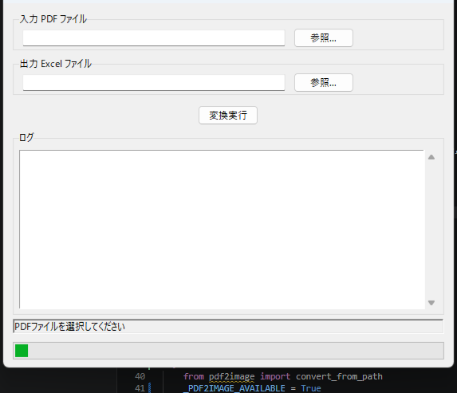
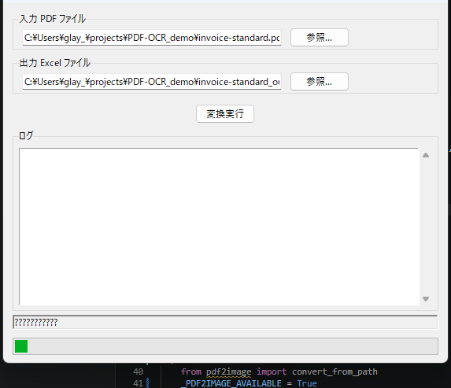
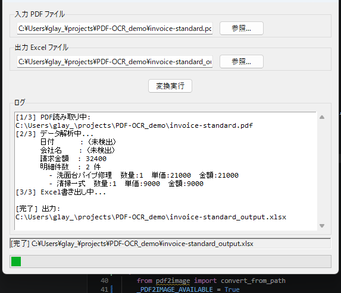

# PDF OCR → Excel 転記ツール

請求書などのPDFを読み取り、表の構成（枠線・結合・数値書式）を保ったままExcelファイルに転記するPythonツールです。  
テキストPDFは直接抽出、スキャンPDFはOCRエンジン（PaddleOCR / Tesseract）で読み取ります。

---

## 機能

| 機能 | 内容 |
|------|------|
| テキストPDF抽出 | pdfplumber でテキスト・表を座標付きで抽出 |
| OCR（主系） | PaddleOCR で高精度な日本語OCR |
| OCR（フォールバック） | Tesseract（PaddleOCR 未インストール時） |
| Excel出力 | openpyxl でセル結合・枠線・数値書式付き出力 |
| GUI | tkinter 製。ファイル選択ダイアログ・進捗ログ・ステータスバー |
| CLI | 引数指定でバッチ処理・自動化にも対応 |

---

## 動作環境

- Python 3.9 以上
- Windows / macOS / Linux

---

## インストール

### 1. 基本パッケージ

```bash
pip install pdfplumber openpyxl numpy
```

### 2. OCRエンジン（スキャンPDF向け・任意）

#### PaddleOCR（推奨）

```bash
pip install paddleocr paddlepaddle   # CPU版
# pip install paddlepaddle-gpu       # GPU版（CUDA環境）
pip install pdf2image pillow
```

> **Poppler** のインストールも別途必要です。  
> - Windows: [Poppler for Windows](https://github.com/oschwartz10612/poppler-windows/releases) をダウンロードし、`bin/` フォルダをPATHに追加  
> - macOS: `brew install poppler`  
> - Linux: `sudo apt install poppler-utils`

#### Tesseract（フォールバック）

```bash
pip install pytesseract
```

> **Tesseract本体** と **日本語学習データ（jpn.traineddata）** のインストールが別途必要です。  
> - Windows: [UB Mannheim ビルド](https://github.com/UB-Mannheim/tesseract/wiki)  
> - macOS: `brew install tesseract tesseract-lang`  
> - Linux: `sudo apt install tesseract-ocr tesseract-ocr-jpn`

---

## 使い方

### GUI モード（引数なしで起動）

```bash
python pdf_ocr_to_excel.py
```

#### 画面説明

**① 起動直後**



入力PDFファイルと出力Excelファイルの入力欄が空の初期状態です。

---

**② ファイル選択後**



「参照…」ボタンでPDFを選ぶと、出力パスが自動補完されます（例: `invoice-standard_output.xlsx`）。  
出力先は「参照…」ボタンで任意のパス・ファイル名に変更できます。

---

**③ 変換完了後**



「変換実行」ボタンを押すと変換が始まり、ログエリアに進捗が表示されます。  
完了するとステータスバーに出力ファイルのパスが表示されます。

---

### CLI モード（引数ありで起動）

```bash
# 出力ファイル名を自動生成（<入力名>_output.xlsx）
python pdf_ocr_to_excel.py invoice.pdf

# 出力ファイル名を指定
python pdf_ocr_to_excel.py invoice.pdf output.xlsx
```

```
[1/3] PDF読み取り中: invoice.pdf
[2/3] データ解析中...
      日付      : （未検出）
      請求金額  : 32400
      明細件数  : 2 件
        - 洗面台パイプ修理  数量:1  単価:21000  金額:21000
        - 清掃一式         数量:1  単価:9000   金額:9000
[3/3] Excel書き出し中...
[完了] Excel出力: output.xlsx
```

---

## OCRエンジンの優先順位

```
pdfplumber（テキストPDF）
    ↓ 抽出テキストが 30 文字未満のとき（スキャンPDFと判定）
PaddleOCR（インストール済みの場合・推奨）
    ↓ PaddleOCR 未インストールのとき
Tesseract（フォールバック）
    ↓ どちらも未インストールのとき
警告を表示して pdfplumber 結果のみで続行
```

---

## Excel 出力レイアウト

請求書フォーマットに対応したレイアウトで出力されます。

| 行 | 内容 |
|----|------|
| 1 | タイトル「請　　求　　書」（セル結合・大字） |
| 2 | 発行日 |
| 3〜5 | 宛先・会社名・住所 |
| 6〜7 | 下記ご請求文・TEL / FAX |
| 8〜12 | 振込先情報・検印欄 |
| 13 | 御請求金額（強調） |
| 15 | 明細ヘッダー（品名 / 数量 / 単価 / 金額 / 摘要） |
| 16〜27 | 明細行（最大12行・空行も枠線付き） |
| 28〜30 | 小計 / 消費税等 / 合計 |
| 31〜33 | 備考欄 |

---

## ファイル構成

```
PDF-OCR_demo/
├── pdf_ocr_to_excel.py   # メインスクリプト
├── requirements.txt      # 依存パッケージ一覧
├── invoice-standard.pdf  # サンプルPDF（請求書）
├── docs/
│   ├── ss1_initial.png   # スクリーンショット（起動直後）
│   ├── ss2_filled.png    # スクリーンショット（ファイル選択後）
│   └── ss3_done.png      # スクリーンショット（変換完了）
└── README.md
```

---

## ライセンス

MIT
